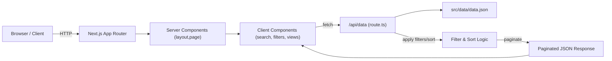
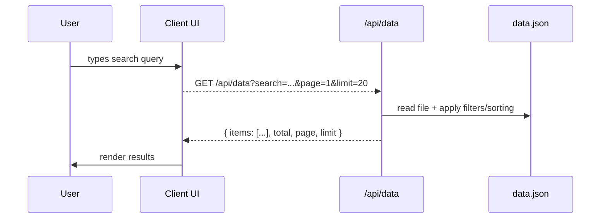

# Prudenbit — Next.js Data App

**Prudenbit** is a Next.js (App Router) TypeScript application that demonstrates a data-driven single-page interface for exploring a large dataset. The project includes a server-side API, interactive client components, and TailwindCSS-based UI. It is organized for clarity, performance, and extensibility.

**Status:** Local development-ready. See the Setup section to run locally.

---

**Table of contents**

- Project Overview
- Project Architecture
  - Mermaid diagrams
  - Architectural decisions
- Setup Instructions
  - Requirements
  - Install and run (dev / prod)
- Component-Level Documentation
  - Component summary table
  - API route details
- Usage Examples
- Best Practices & Contribution Guidelines
  - Coding conventions
  - Folder structure
  - How to extend
- Troubleshooting & Next Steps

---

## Project Overview

- High-level description

  Prudenbit is a data exploration web app built with Next.js App Router and TypeScript. It exposes a local API backed by a JSON dataset and provides client UI components to search, filter, sort, and paginate through records.

- Goals, scope, and purpose

  - Provide a clean, responsive UI for navigating large datasets (the included `src/data/data.json`).
  - Demonstrate correct use of Next.js Server Components and Client Components.
  - Keep heavy operations server-side (filter/sort/paginate) so the client receives only needed data pages.
  - Serve as a template for building admin dashboards, reporting tools, or data explorers.

---

## Project Architecture

This project separates responsibilities into layers:

- Presentation: React components (Server & Client) under `src/app` and `src/components`.
- API surface: Next.js route handler(s) under `src/app/api/*` which read and process `src/data/data.json`.
- Styling: TailwindCSS utility classes configured in `tailwind.config.ts`.
- Demo: A `demo/` folder with a Vite playground and UI primitives for prototyping.

### Architectural diagram (component flow)



### Sequence diagram (search request)



### Key architectural decisions and rationale

- Next.js App Router and Server Components: initial rendering and layout are implemented as server components to keep initial payload small and improve TTFB. Client components (`"use client"`) are used for interactive parts (search, filters, pagination).
- Server-side filtering and pagination: reading and processing `data.json` on the server avoids sending the whole dataset to the browser and centralizes correctness (filter -> sort -> paginate sequence).
- TailwindCSS + UI primitives: utility-first approach keeps styles consistent and small; primitives under `components/ui` make it easy to maintain consistent look-and-feel.
- TypeScript: ensures contract correctness for props, API shapes, and reduces runtime errors.

---

## Setup Instructions

### Requirements

- Node.js 18+ (LTS recommended)
- pnpm (recommended) or npm/yarn
- Git (optional)

> Notes: The repository includes a `pnpm-lock.yaml`. Using `pnpm` will reproduce the exact dependency tree used during development.

### Install dependencies

```bash
# Using pnpm (recommended)
pnpm install

# or npm
npm install

# or yarn
yarn
```

### Run in development mode

```bash
# Using pnpm
pnpm dev

# or npm
npm run dev

# Then open http://localhost:3000
```

### Build and run for production

```bash
# Build
pnpm build

# Run
pnpm start

# or with npm
npm run build
npm start
```

If you deploy on Vercel, the default `build` and `start` scripts are compatible with Vercel's platform.

### Environment variables

There are no required secret environment variables for local development. If you add integrations (analytics, external APIs), add them to a `.env` file and ensure they're loaded in your deployment environment.

---

## Component-Level Documentation

Below is a component summary for the most relevant files and modules in this repository.

> Paths are given relative to project root.

### Major components summary

| Component | Path | What it does | Where it fits | Interactions |
|---|---|---|---|---|
| App Layout | `src/app/layout.tsx` | Root server component; sets global CSS and layout shell | App Router (server) | Renders `page.tsx`, includes header/banner components |
| Home Page | `src/app/page.tsx` | Main page (server) — renders top-level UI and client components container | App Router | Hosts client components (search/filters/list) |
| Data API | `src/app/api/data/route.ts` | GET route handler serving data from `src/data/data.json` with search/filter/sort/pagination | Server API | Consumed by client components via `fetch` |
| HeaderBanner | `src/components/HeaderBanner.tsx` | Header and top controls (search, quick filters) | Client UI | Emits search/filter state to parent / performs fetches |
| PatientTable | `src/components/PatientTable.tsx` | Table/row view rendering of records, includes sorting and pagination controls | Client UI | Receives paginated data from API; emits user actions |
| PatientCard | `src/components/PatientCard.tsx` | Card view for individual records | Client UI | Used in grid/list view; receives a single record prop |
| UI primitives | `demo/components/ui/*` & `src/components/ui/*` | Shared primitives (Button, Card, Avatar, Badge) built with Tailwind/shadcn patterns | Shared | Used throughout components for consistent styling |
| Data file | `src/data/data.json` | Dataset (1,000+ objects) | Server data source | Read by `route.ts` and processed for queries |

### API Route: responsibilities and params

The Data API route (typically at `src/app/api/data/route.ts`) implements the following behavior:

- Query parameters supported (examples):
  - `page` (number, default 1)
  - `limit` (number, default 20)
  - `search` (string, global text search across record fields)
  - `sortBy` (string, field name)
  - `order` (`asc` | `desc`)
  - Additional filters such as `status`, `type` (dataset-specific fields)

- Implementation notes:
  - Apply filters and search first.
  - Apply sorting next.
  - Apply pagination last (slice the sorted/filtered array).
  - Return JSON in the shape: `{ items: Record[], total: number, page: number, limit: number }`.

> If you want, I can add an example `OpenAPI` spec and the exact TypeScript types for the request/response shapes.

---

## Usage Examples

### Client fetch example

```ts
// Client-side fetch for page 1 with search and sorting
const url = `/api/data?search=jane&page=1&limit=20&sortBy=lastName&order=asc`;
const res = await fetch(url);
const payload = await res.json();
console.log(payload.total, payload.items.length);
```

### Minimal client component (paginated list)

```tsx
"use client";
import { useEffect, useState } from 'react';

export default function SimpleList() {
  const [q, setQ] = useState('');
  const [items, setItems] = useState<any[]>([]);

  useEffect(() => {
    let cancelled = false;
    (async () => {
      const r = await fetch(`/api/data?search=${encodeURIComponent(q)}&page=1&limit=10`);
      const j = await r.json();
      if (!cancelled) setItems(j.items || []);
    })();
    return () => { cancelled = true; };
  }, [q]);

  return (
    <div>
      <input value={q} onChange={(e) => setQ(e.target.value)} placeholder="Search..." />
      <ul>
        {items.map((it) => (
          <li key={it.id}>{it.name ?? it.title ?? JSON.stringify(it)}</li>
        ))}
      </ul>
    </div>
  );
}
```

---

## Best Practices & Contribution Guidelines

### Coding conventions

- Use TypeScript types for API responses and component props.
- Annotate client files that use hooks with `"use client"` at the top.
- Keep Server Components free of React state and side effects.
- Break UI into small, testable components. Reuse UI primitives found in `components/ui` or `demo/components/ui`.
- Use Tailwind utility classes for consistent styling.

### Folder structure (short)

- `src/app/` — Next.js App Router pages and route handlers.
- `src/components/` — Reusable React components for the app.
- `src/data/` — Dataset files used by the local API.
- `demo/` — Vite-based playground and UI primitives for prototyping.

### How to extend or modify

- Add an API filter: update `src/app/api/data/route.ts` to accept and apply the new param before sorting/pagination.
- Add a view: create a new client component in `src/components/` and import/render it from `src/app/page.tsx` or a relevant parent.
- Add tests: integrate a test runner (Vitest / Jest + React Testing Library) and add tests in a `tests/` directory.

### Contribution workflow

1. Fork the repository and create a feature branch.
2. Make small, focused commits with clear messages.
3. Add or update tests where appropriate.
4. Open a pull request describing the change and its motivation.

---

## Troubleshooting & Next Steps

- If you see TypeScript errors after pulling, run `pnpm install` and verify your Node.js version. Restart the dev server.
- The `demo/` folder can run separately with Vite; inspect its `package.json` scripts.

### Suggested improvements

- Add server-side caching for repeated API queries to improve response times.
- Implement a debounced search input on the client to reduce requests while typing.
- Add both Card and Table views and a toggle to switch between them.
- Provide a small `OpenAPI` or JSON Schema for the API route response and types.

---

If you'd like, I can now:

- Run `pnpm install` and `pnpm dev` to verify the app boots locally, or
- Open `src/app/api/data/route.ts` to generate exact API parameter docs and example responses (I can add an OpenAPI snippet).
